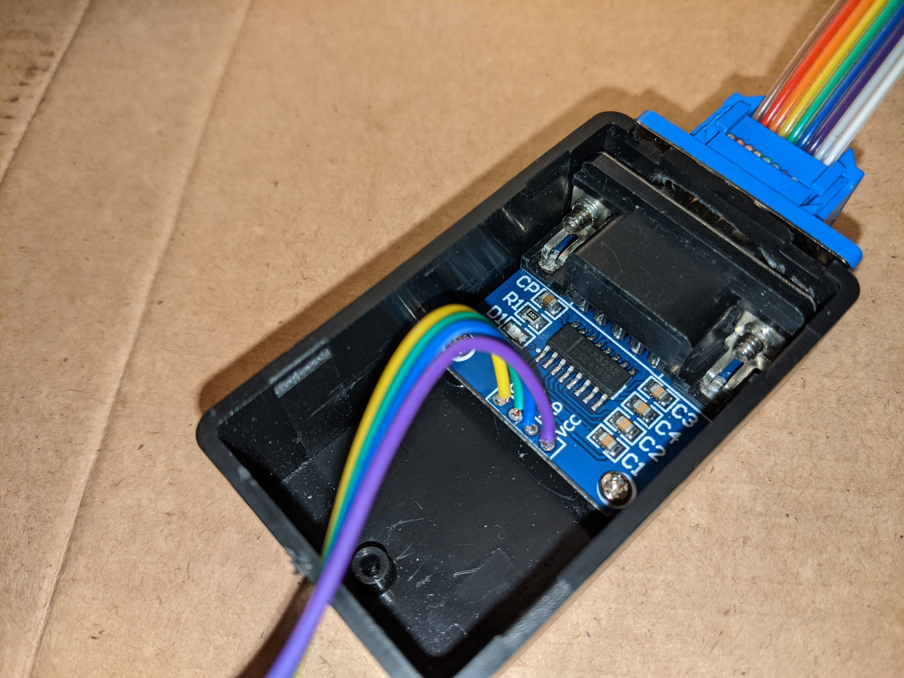
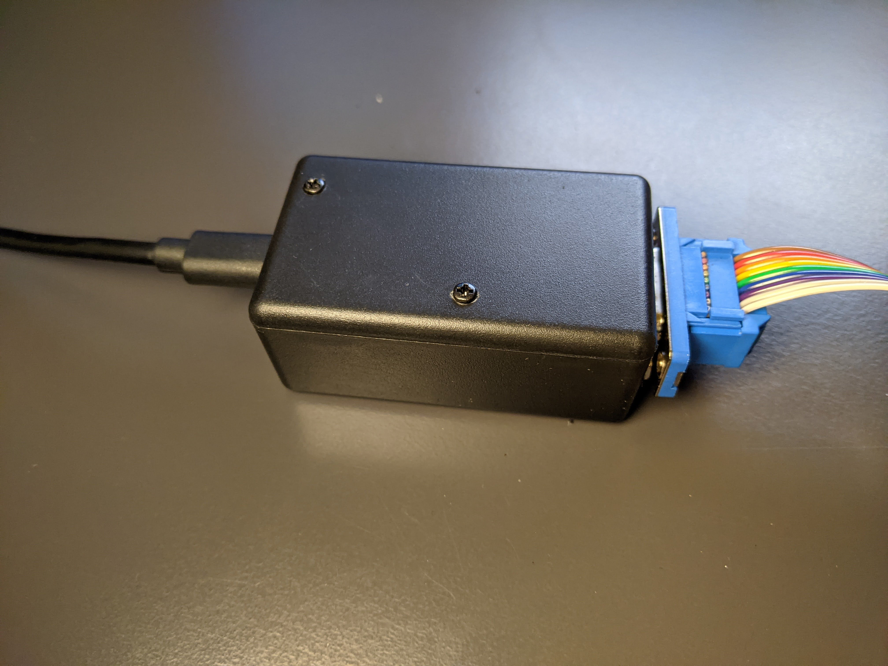

# ESP KYO Alarm

## Disclaimer

KYO alarm integration over native API using ESPHome.

*This project is not related to or endorsed by the KYO alarm production company.*

*The interaction with the alarm panel is performed in an unconventional way, not endorsed by official documentation.*

*The warranty of the alarm panel will be invalidated by installing this device.*

*Any intervention on the alarm system must be performed by qualified personel.*

*This software is provided "as is", without warranty of any kind, express or implied, including but not limited to the warranties of merchantability, fitness for a particular purpose and noninfringement. in no event shall the authors or copyright holders be liable for any claim, damages or other liability, whether in an action of contract, tort or otherwise, arising from, out of or in connection with the software or the use or other dealings in the software.*

All that said happy hacking, but pay attention to what you are doing. The alarm system is a critical component for the security of a house.

This project was inspired by [lorenzo-deluca/espkyogate](https://github.com/lorenzo-deluca/espkyogate), if you want you can [buy him a coffee ☕](https://www.buymeacoffee.com/lorenzodeluca).

## Hardware

This project connects to the alarm panel over an RS-232 serial link. The bill of materials is:

* [Wemos D1 Mini V3.0.0](https://it.aliexpress.com/item/4001142182616.html) (can be used any ESP8266 board)
* [MAX3232 TTL/RS-232 converter](https://it.aliexpress.com/item/32722395554.html)
* [DB9 male/female 20 cm flat cable](https://it.aliexpress.com/item/33029129554.html)
* [DC-DC converter 12V to 5V, 15W micro USB](https://it.aliexpress.com/item/32581610768.html)

Optional:

* [Plastic Box 25x36x61mm](https://it.aliexpress.com/item/4001075657658.html)
* [M2, 4mm screw](https://it.aliexpress.com/item/1005002329023725.html)
* [M2.5, 4mm screw](https://it.aliexpress.com/item/1005002329023725.html)
* [M2 40mm plastic f/f spacer](https://it.aliexpress.com/item/32976004197.html)

Since the plastic box was too small to fit the two PCBs, I mounted the MAX3232 TTL/RS-232 converter on the bottom (there were spacers that fitted the holes on the PCB) and the Wemos D1 Mini on the cover, being partially overlapped with the closed box.

The total cost of this project is about 10€.

This is the circuit required by this integration.


Since the ESP8266 is a +3.3V device, connect the VCC pin of the MAX3232 TTL RS-232 converter to the 3V3 pin of the ESP board, otherwise you will risk to break the RX pin of the Wemos D1 Mini.

The DC/DC converter can be connected to any auxiliary power supply of the alarm system, in case of mains power failure the ESP8266 board will survive thanks to the backup battery.





## ESPHome Configuration

Before generating the ESPHome firmware, the configuration file `esp-kyo-alarm.yaml` must be customized. Set `board` key according to your ESP8266 board.

```yaml
esphome:
  name: ${name}
  platform: ESP8266
  board: d1_mini
  comment: "ESP KYO alarm integration"
  includes:
    - kyo-alarm/
```

Configure the `tx_pin` and `rx_pin` keys of UART link depending on your hardware.

```yaml
uart:
  id: uart_bus
  tx_pin: GPIO5
  rx_pin: GPIO4
  baud_rate: 9600
  data_bits: 8
  parity: EVEN
```

I used GPIO5 and GPIO4 (software UART) in place of ESP8266 hardware UART, since during early experiments RX pin of hardware UART stopped working (due to an erroneous +5V input signal).

Set the configuration of the partitions in *armed_home* and *armed_away* configurations. First partition is bit 0, last partition is bit 7.

```yaml
globals:
  # Arm home partitions (bitfield) as configured in alarm
  - id: armed_home
    type: uint8_t
    restore_value: no
    initial_value: '0x1'
  # Arm away partitions (bitfield) as configured in alarm
  - id: armed_away
    type: uint8_t
    restore_value: no
    initial_value: '0x3'
```

Map the available zones in your alarm, adding proper `device_class`. 

```yaml
binary_sensor:
  # Zones status
  - platform: custom
    lambda: |-
      KyoAlarmComponent* k = (KyoAlarmComponent*) kyo;
      return {&k->zoneSensor[0], &k->zoneSensor[1],
              &k->zoneSensor[2], &k->zoneSensor[3]};
    binary_sensors:
      - id: kyo_zone1
        name: "Zone 1"
        device_class: "motion"
      - id: kyo_zone2
        name: "Zone 2"
        device_class: "window"
      - id: kyo_zone3
        name: "Zone 3"
        device_class: "door"
      - id: kyo_zone4
        name: "Zone 4"
        device_class: "garage_door"
```

Available device classes are:

| Device class | Home Assistant icons                                                                                          |
| ------------ | :-----------------------------------------------------------------------------------------------------------: |
| motion       |                                     |
| window       |   |
| door         |                     |
| garage_door  |                 |

A `secrets.yaml` file is required with the following keys:

```yaml
wifi_ssid: "<your-wifi-ssid>"
wifi_password: "<your-wifi-password>"
ota_password: "<your-ota-password>"
api_encryption_key: "<your-encryption-key>"
```

It is highly reccomanded to connect using native [API encryption](https://esphome.io/changelog/2021.9.0.html#api-encryption) introduced since ESPHome version 2021.9.0. Alternartivelly with small modification to the code a secured MQTT over SLL connection can be configured.

To improve security OTA flash can be disabled.

## Home Assistant Integration

In Home Assistant a [Template Alarm Control Panel](https://www.home-assistant.io/integrations/alarm_control_panel.template) initegration can be configured as follow.

```yaml
alarm_control_panel:
  - platform: template
    panels:
      kyo_alarm:
        name: "Kyo Alarm"
        unique_id: "kyo-alarm"
        value_template: "{{states('sensor.alarm_status')}}"
        arm_away:
          - service: esphome.esp_kyo_alarm_arm_away
            data_template:
              code: "{{code}}"
        arm_home:
          - service: esphome.esp_kyo_alarm_arm_home
            data_template:
              code: "{{code}}"
        disarm:
          - service: esphome.esp_kyo_alarm_disarm
            data_template:
              code: "{{code}}"
```

With this configuration the PIN code is transmitted to the alarm panel over encrypted native API and the ESPHome firmware checks its value against the list of PINs stored in the alarm. This behaviuour can be modified in the source code to perform the check of the PIN inside Home Assistant itself or to avoid the check at all, but doing so will decrease the security level of this integration.

Additionally a Lovelace [Alarm Panel Card](https://www.home-assistant.io/lovelace/alarm-panel/) to arm/disarm the alarm via the user interface can be addded.

To manually control the arming/disarming of the alarm three services are available. All of them require a single parameter `code` providing the user PIN.

```yaml
service: esphome.esp_kyo_alarm_arm_home
data:
  code: 123456
```

```yaml
service: esphome.esp_kyo_alarm_arm_away
data:
  code: 123456
```

```yaml
service: esphome.esp_kyo_alarm_disarm
data:
  code: 123456
```
Alarm memory can be reset with the service.

```yaml
service: esphome.esp_kyo_alarm_reset
```

Having the alarm system sensors integrated into Home Assistant allows extra configurations. A nice example is [window open, climate off](https://community.home-assistant.io/t/window-open-climate-off/257293) blueprint, to switch off the climate system when a window is opened.

[](https://my.home-assistant.io/redirect/blueprint_import/?blueprint_url=https%3A%2F%2Fcommunity.home-assistant.io%2Ft%2Fwindow-open-climate-off%2F257293)

To trigger the action monitoring several windows at the same time, create a group of windows.
